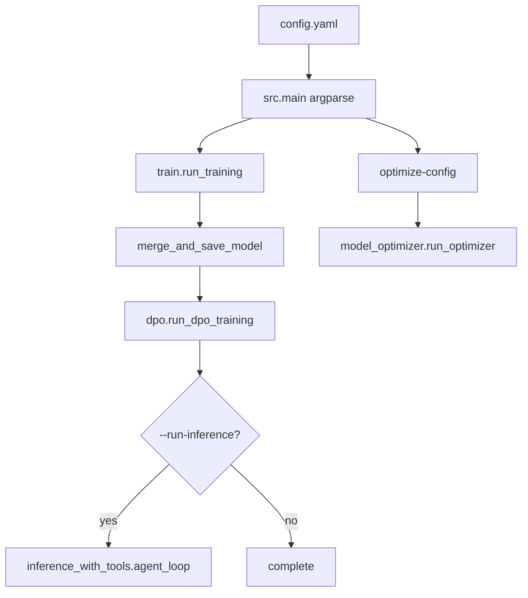

# ai-factory Root

***

## Table of Contents

1.  [Overview](#overview)
2.  [Directory / Module Map](#directory--module-map)
3.  [Public Interfaces](#public-interfaces)
4.  [Execution and Control Flow](#execution-and-control-flow)
5.  [Data Flow](#data-flow)
6.  [Integration Points](#integration-points)
7.  [Configuration and Conventions](#configuration-and-conventions)
8.  [Extension and Testing Guidance](#extension-and-testing-guidance)
9.  [Visualizations](#visualizations)
10. [Mathematical Framing](#mathematical-framing)

***

## Target: ai-factory (Root)

### Overview

**Purpose:** AI Factory is a pipeline for fine-tuning, aligning, and serving local LLMs with QLoRA SFT, merge, DPO, and optional tool-augmented inference. Sample config defaults to `Qwen/Qwen3.5-9B` on consumer GPUs (e.g. RTX 4070 8GB).

This file is a **root architecture summary**. For narrative flow see [OVERVIEW](../OVERVIEW.md). Per-module deep dives live under `docs/codebase_docs/`.

**Key responsibilities:**

*   QLoRA SFT (ICDU data) → merge → DPO (messages JSONL) → optional inference
*   Hardware-aware `optimize-config` presets
*   Attention backends + optional Qwen3.5 linear-attention kernels
*   Full-checkpoint loading (`model.preserve_all_tensors`, default `true`): loads the architecture a checkpoint declares, so a multimodal base keeps its vision tower through merge instead of being silently reduced to its text submodel
*   Tool agent via `inference_with_tools` (main pipeline); `tools.py` is a lighter sibling

***

### Directory / Module Map

```
ai-factory/
├── src/
│   ├── main.py                     # argparse CLI: full pipeline + optimize-config
│   ├── config.py / config.yaml     # Pydantic ScriptConfig; sample Qwen3.5-9B
│   ├── train.py                    # SFT + merge (also train.run_pipeline = SFT+merge only)
│   ├── dpo.py                      # Preference pairs + DPOTrainer; standalone CLI
│   ├── model_setup.py              # load_model/tokenizer; FA/SDPA; linear kernels
│   ├── inference_with_tools.py     # Pipeline inference agent (registered tools)
│   ├── tools.py                    # Lightweight alternate agent (not used by main)
│   ├── utils.py / hardware.py      # Environment / HardwareProfile
│   ├── model_optimizer.py          # Preset recommendations
│   ├── data/                       # ICDU load/format + generators/augmenters
│   └── helper_scripts/
├── tests/                          # pytest (see list below)
├── docs/
│   ├── OVERVIEW.md
│   └── codebase_docs/              # Module documentation
├── pyproject.toml
├── requirements.txt
├── environment.yml                 # conda env name ai-factory
└── README.md
```

**Module docs index:** [main](main__documentation.md) · [config](config__documentation.md) · [train](train__documentation.md) · [dpo](dpo__documentation.md) · [model_setup](model_setup__documentation.md) · [data](data__documentation.md) · [inference_with_tools](inference_with_tools__documentation.md) · [tools](tools__documentation.md) · [model_optimizer](model_optimizer__documentation.md) · [utils_and_hardware](utils_and_hardware__documentation.md)

***

### Public Interfaces

| Interface | Type | Purpose |
| --------- | ---- | ------- |
| `cli` / `python -m src.main` | argparse | Full pipeline or `optimize-config` |
| `run_pipeline` (main) | Function | SFT → merge → DPO → optional inference |
| `run_training` / `merge_and_save_model` | Function | SFT + merge |
| `run_dpo_training` / `generate_preference_pairs` | Function | DPO |
| `agent_loop` / `load_model_pipeline` | Function | Tool inference |
| `load_model` / `load_tokenizer` / `validate_linear_attention_kernels` | Function | Model setup |
| `load_and_prepare_dataset` / `VectorizedCompletionOnlyCollator` | data/ | ICDU SFT prep |
| `recommend` / `run_optimizer` | Function | Config optimizer |
| `Environment` / `HardwareProfile` | Class | Hardware detection |
| `ScriptConfig` | Pydantic | Root config |

***

### Execution and Control Flow

```bash
python -m src.main --config-path src/config.yaml
python -m src.main --config-path src/config.yaml --run-inference
python -m src.main optimize-config --config-path src/config.yaml --preset balanced -o out.yaml
conda run -n ai-factory python -m pytest   # preferred Windows training/test stack
```

1. Load YAML → resolve paths vs config parent → `ScriptConfig`
2. Phase 1 SFT (ICDU) → `final_adapter/`
3. Phase 2 merge (CPU) → `final_merged_model/`
4. Phase 3 DPO (messages JSONL; QLoRA `q_proj`/`v_proj`) → `dpo_model/`
5. Optional Phase 4: `inference_with_tools.agent_loop`

***

### Data Flow

```
ICDU JSONL → format_icdu_to_chat → SFT → adapter → merge
messages JSONL → preference pairs → DPO
query → agent_loop → tools → response
```

**Formats:** SFT = ICDU only. DPO = messages chat JSONL (often separate `dpo.train_file`).

***

### Integration Points

| Module | Role |
| ------ | ---- |
| `main.py` | Orchestration (argparse) |
| `train.py` | SFT + merge |
| `dpo.py` | DPO (own model load; no `load_model` attn resolver) |
| `model_setup.py` | Shared SFT load + kernel validation |
| `inference_with_tools.py` | Pipeline inference |
| `tools.py` | Alternate lightweight agent |
| `data/` | ICDU + generation scripts |

**Libraries:** PyTorch, Transformers, PEFT, TRL, BitsAndBytes, optional Flash Attention / flash-linear-attention, Pydantic, PyYAML. CLI is **argparse** (not Typer), even if `environment.yml` still lists typer.

***

### Configuration and Conventions

*   Sample model: `Qwen/Qwen3.5-9B`; keys include `use_linear_attention_kernels`, `save_only_model`, full `dpo:` block.
*   Gemma 4: prefer `attn_implementation: sdpa` (global head dim not auto-guarded).
*   Windows: conda `ai-factory`, `$env:KMP_DUPLICATE_LIB_OK='TRUE'`; Python minor pins may differ across `environment.yml` / wheels / `pyproject.toml`.

***

### Extension and Testing Guidance

**Run tests from repo root:**

```bash
conda run -n ai-factory python -m pytest
.\venv\Scripts\python.exe -m pytest
pytest -m "not slow"
```

**Test modules present:**

*   `tests/test_config.py`, `test_main_config.py`, `test_main_cli.py`
*   `tests/test_data.py`, `test_data_scripts_smoke.py`, `test_master_generate_icdu.py`
*   `tests/test_train.py`, `test_dpo.py`, `test_model_setup.py`, `test_model_optimizer.py`, `test_preserve_tensors.py`
*   `tests/test_inference_with_tools.py`, `test_tools.py`, `test_tools_module.py`, `test_utils.py`

There is **no** `tests/test_training.py`.

***

### Visualizations



***

### Mathematical Framing

QLoRA trains low-rank adapters on 4-bit weights. DPO optimizes Bradley-Terry preferences with temperature `β`. Effective batch ≈ `per_device_batch × grad_accum × GPUs`.

***

*Last updated: 2026-08-23. Prefer [OVERVIEW](../OVERVIEW.md) and per-module docs for detail.*
