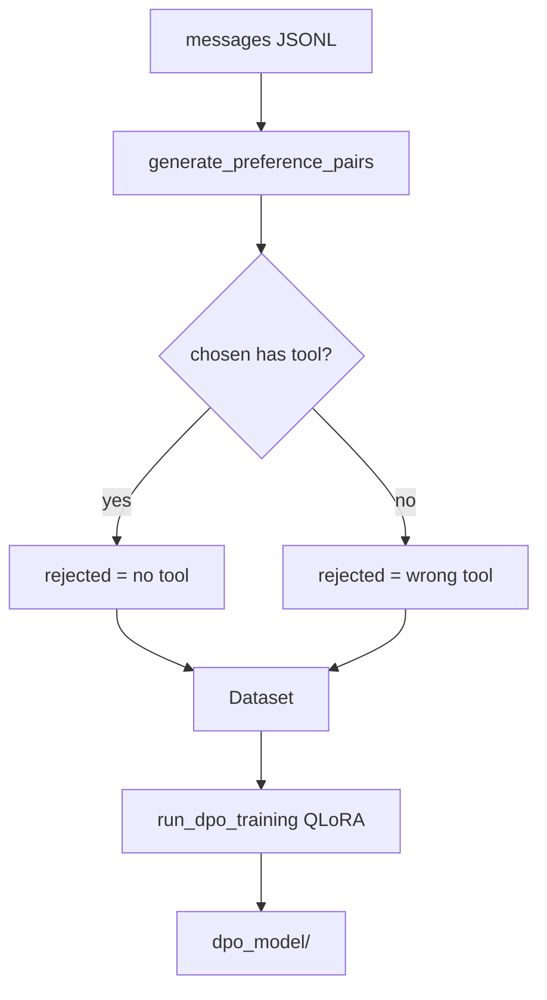

# src/dpo.py

## 1. Overview

The `dpo.py` module implements Direct Preference Optimization for tool-selection behavior. It builds preference pairs from **messages-format** JSONL (e.g. Breaking Better augmented chat) and trains with TRL `DPOTrainer` under hardcoded QLoRA (NF4, LoRA on `q_proj`/`v_proj` only).

**Purpose:** Prefer correct tool use over missing or wrong tool calls.

**Entry points:**

*   **Pipeline Phase 3:** [main](main__documentation.md) `run_pipeline` after merge.
*   **Standalone:** `python -m src.dpo --input ... --output ... --model_path ... --training_output_dir ...`

**Important format note:** SFT uses **ICDU** ([data](data__documentation.md)). DPO input must be chat `messages` JSONL. Sample config points `dpo.train_file` at a Breaking Better file while SFT uses ICDU paths.

**Connections:** Consumed by main; validates linear kernels via [model_setup](model_setup__documentation.md); does **not** use `load_model` attention resolution.

## 2. Directory/Module Map

```
ai-factory/
├── src/
│   ├── dpo.py                # <-- THIS MODULE
│   ├── train.py              # SFT/merge (upstream artifacts)
│   ├── config.py             # DPOConfig via main
│   ├── data/                 # ICDU for SFT (not used directly by dpo)
│   ├── model_setup.py        # validate_linear_attention_kernels
│   └── main.py               # Phase 3 orchestration
├── tests/
│   └── test_dpo.py
└── docs/codebase_docs/
    └── dpo__documentation.md
```

## 3. Public Interfaces

| Function | Description |
| -------- | ----------- |
| `load_jsonl` / `save_jsonl` | Read/write JSONL lists of dicts |
| `generate_preference_pairs` | messages → `{prompt, chosen, rejected}` |
| `prepare_dpo_dataset` | List → HF `Dataset` |
| `run_dpo_training` | QLoRA DPO train; optional `torch_compile`, `use_linear_attention_kernels` |
| `main` | Standalone argparse CLI |

### Internal helpers

| Function | Role |
| -------- | ---- |
| `_is_triton_available` | Gate for torch.compile (typically Linux) |
| `_has_tool_call` | Detects `tool_call` or `Need data:` |
| `_extract_text_without_tool` | Strip tool section for rejected |
| `_generate_incorrect_tool_response` | Random wrong tool from `KNOWN_TOOLS` |

## 4. Execution and Control Flow

### Preference generation

```
For each example with messages:
  user_msg, assistant_response
  prompt = "[INST]" + user_msg + "[/INST]"   # Mistral-style wrappers (kept for DPO pairs)
  chosen = assistant_response
  if chosen has tool call:
      rejected = text without tool
  else:
      rejected = response with incorrect tool
```

### run_dpo_training

```
validate_linear_attention_kernels(flag)
BitsAndBytesConfig NF4 + float16 compute (hardcoded)
AutoModelForCausalLM.from_pretrained(...)  # NO attn_implementation kwarg
prepare_model_for_kbit_training
LoraConfig(r=lora_rank, target_modules=["q_proj","v_proj"])
DPOConfig / TrainingArguments + DPOTrainer (TRL API versioning)
if torch_compile and Triton: torch.compile(model); else warn and skip
train → save under output_dir
```

### Standalone CLI (`python -m src.dpo`)

| Flag | Required | Notes |
| ---- | -------- | ----- |
| `--input` | yes | messages JSONL |
| `--output` | yes | write preference JSONL |
| `--model_path` | yes | HF id or local path |
| `--training_output_dir` | yes | DPO output |
| `--lora_rank` | no | module default (often 16 in CLI constants; config default 32) |
| `--max_steps` | no | |
| `--learning_rate` | no | |
| `--torch_compile` | no | flag |

## 5. Data Flow

```
messages JSONL → preference pairs → Dataset(prompt, chosen, rejected)
    → QLoRA DPOTrainer → dpo_model/ (or training_output_dir)
```

Upstream from main: prefer `final_merged_model` as base; else `config.model.name`.

## 6. Integration Points

| Dependency | Usage |
| ---------- | ----- |
| `trl.DPOTrainer` / `DPOConfig` | Training; beta on DPOConfig in modern TRL |
| `peft` | LoRA + kbit prep |
| `transformers` | Direct model/tokenizer load |
| `src.model_setup.validate_linear_attention_kernels` | Optional fail-fast |

**Attention caveat:** Unlike SFT `load_model`, DPO does not pass `attn_implementation` or run FA2 head-dim fallback. FA2-incompatible models (e.g. Gemma 4 global heads) need care outside this path.

## 7. Configuration and Conventions

*   Prompt wrappers: `INST_START` / `INST_END` (`[INST]` / `[/INST]`).
*   QLoRA targets hardcoded to `q_proj`, `v_proj` (not full SFT LoRA list).
*   `KNOWN_TOOLS` drives incorrect-tool rejection sampling.
*   `torch_compile` skipped when Triton missing (Windows).
*   Main passes most hyperparameters from `DPOConfig`; `per_device_eval_batch_size` is not wired into `run_dpo_training` from main.

## 8. Extension and Testing Guidance

*   Tests: `tests/test_dpo.py`.
*   To share attention guards with SFT, route DPO load through `load_model` or duplicate `_resolve_attention_implementation`.
*   Expand `KNOWN_TOOLS` when new tools appear in training data.

## 9. Visualizations



## 10. Mathematical Framing

```
L_DPO = -E[log σ(β (log πθ(yw|x)/πref(yw|x) - log πθ(yl|x)/πref(yl|x)))]
```

`β` = `config.dpo.beta` (default 0.1). Chosen/rejected encode correct vs incorrect tool behavior.

***

*Last updated: 2026-08-02.*
