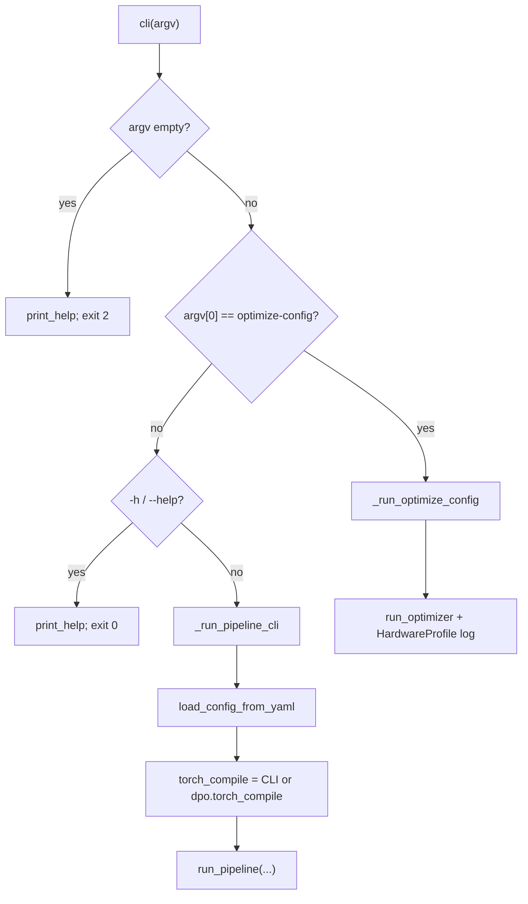
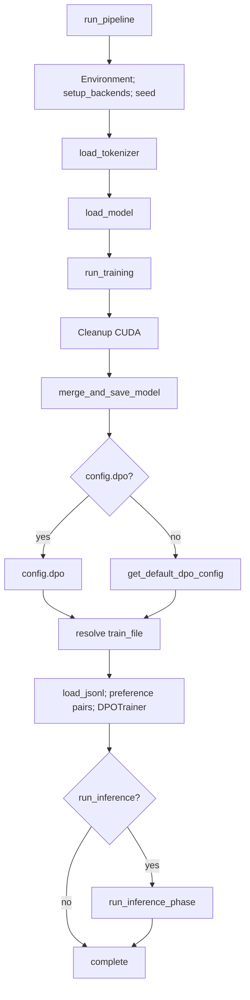
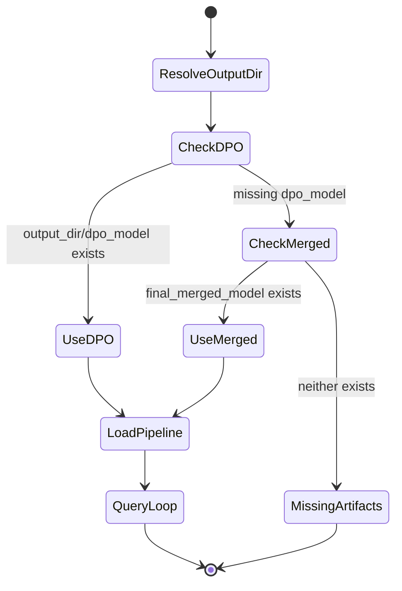

# src/main.py -- Pipeline CLI Entry Point

## 1. Overview

This module is the CLI entry point for the full ai-factory training and inference pipeline. It orchestrates the complete workflow: QLoRA fine-tuning, LoRA weight merging, DPO (Direct Preference Optimization) training, and optional tool-augmented inference. A secondary subcommand `optimize-config` invokes the Model Optimizer to suggest hardware-aware config values.

**Purpose:** Provide a single, unified command-line interface (argparse) that drives the entire model training and deployment workflow.

**Connections in wider system:**

*   **[config](config__documentation.md)** (`src/config.py`): Receives a validated `ScriptConfig` from YAML configuration.
*   **[train](train__documentation.md)** (`src/train.py`): Delegates QLoRA training (`run_training`) and model merging (`merge_and_save_model`).
*   **[dpo](dpo__documentation.md)** (`src/dpo.py`): Delegates preference pair generation and DPO training.
*   **[inference_with_tools](inference_with_tools__documentation.md)**: Delegates inference to the tool-augmented agent loop (`agent_loop`).
*   **[model_setup](model_setup__documentation.md)**: Uses `load_model` and `load_tokenizer` for SFT initialization.
*   **[data](data__documentation.md)** (`src/data/`): Used indirectly via `train.py` for ICDU loading/collation.
*   **[utils_and_hardware](utils_and_hardware__documentation.md)**: `Environment` for backends; `HardwareProfile` for optimize-config.
*   **[model_optimizer](model_optimizer__documentation.md)**: Invoked via `optimize-config`.

See also the application [OVERVIEW](../OVERVIEW.md).

## 2. Directory/Module Map

```
ai-factory/
  src/
    main.py                  <-- THIS MODULE: argparse CLI, pipeline orchestration
    config.py                ScriptConfig, DataConfig, TrainingConfig, DPOConfig
    train.py                 run_training(), merge_and_save_model()
    dpo.py                   generate_preference_pairs(), run_dpo_training(), ...
    inference_with_tools.py  agent_loop(), load_model_pipeline()
    model_setup.py           load_model(), load_tokenizer()
    utils.py                 Environment (backend detection)
    model_optimizer.py       run_optimizer(), PRESETS
    hardware.py              HardwareProfile
    tools.py                 Lightweight alternate agent (not used by main pipeline)
    data/
      __init__.py
      augment_dataset.py
      generate_icdu_*.py
      master_generate_icdu.py
      ...
    helper_scripts/
```

### Grouping by Responsibility

| Group                   | Modules                            |
| ----------------------- | ---------------------------------- |
| CLI / Orchestration     | `main.py`                          |
| Configuration           | `config.py`, `config.yaml`         |
| Training                | `train.py`, `model_setup.py`       |
| Preference Optimization | `dpo.py`                           |
| Inference               | `inference_with_tools.py`          |
| Optimization            | `model_optimizer.py`, `hardware.py`|
| Data Processing         | `data/`                            |
| Utilities               | `utils.py`                         |

## 3. Public Interfaces

| Interface | Type | Purpose |
| --------- | ---- | ------- |
| `cli(argv=None) -> int` | Function | Top-level dispatch: empty argv → help exit 2; `optimize-config` → optimizer; else pipeline. |
| `_build_pipeline_parser(prog) -> ArgumentParser` | Function (private) | Pipeline flags: `--config-path`, `--run-inference`, `--example-queries`, `--torch-compile`. |
| `_build_optimize_config_parser(prog) -> ArgumentParser` | Function (private) | Optimizer flags: `--config-path`, `-p/--preset`, `-o/--output`. |
| `_run_pipeline_cli(argv) -> int` | Function (private) | Parse pipeline args, load config, call `run_pipeline`. |
| `_run_optimize_config(argv) -> int` | Function (private) | Parse optimizer args, call `run_optimizer`. |
| `load_config_from_yaml(path: Path) -> ScriptConfig` | Function | Load/validate YAML; resolve relative paths against config parent. |
| `_resolve_config_paths(config_dict, base_dir) -> dict` | Function (private) | Resolve `data.*`, `training.output_dir`, `dpo.output_dir` / `dpo.train_file`. |
| `_find_model_path(config: ScriptConfig) -> Path` | Function (private) | Prefer `dpo_model` over `final_merged_model`. |
| `run_inference_phase(config, example_queries) -> None` | Function | Load best model via `load_model_pipeline`; run `agent_loop` per query. |
| `run_pipeline(config, run_inference, example_queries, torch_compile) -> None` | Function | Full 4-phase pipeline: Training → Merging → DPO → optional Inference. |

### CLI usage

```bash
python -m src.main --config-path src/config.yaml
python -m src.main --config-path src/config.yaml --run-inference \
  --example-queries "Calculate 2+2" --torch-compile
python -m src.main optimize-config --config-path src/config.yaml \
  --preset balanced -o optimized.yaml
```

## 4. Execution and Control Flow

### Pipeline Entry (`cli` → `_run_pipeline_cli`)

1.  **Parse CLI args** with argparse (`--config-path` required; optional `--run-inference`, repeatable `--example-queries`, `--torch-compile`).
2.  **Load config**: `load_config_from_yaml(config_path)`.
3.  **Resolve torch_compile**: CLI flag **OR** `config.dpo.torch_compile` (if `dpo` present).
4.  **Run pipeline**: `run_pipeline(config, ...)`. Exit `0` on success, `1` on failure / KeyboardInterrupt.

### run_pipeline() -- Four Sequential Phases

```
Phase 1: TRAINING (QLoRA)
  |-- Environment.setup_backends()
  |-- torch.manual_seed(config.training.seed)
  |-- load_tokenizer(config.model)
  |-- load_model(config.model, config.quantization, env)
  |-- run_training(config, env, tokenizer, quantized_model)
  |-- cleanup: del quantized_model, torch.cuda.empty_cache()
  |
Phase 2: MERGING
  |-- merge_and_save_model(config, env)
  |
Phase 3: DPO (Direct Preference Optimization)
  |-- Resolve DPO config (from config.dpo or get_default_dpo_config())
  |-- Resolve dpo_train_file: prefer dpo_config.train_file, fallback to data.train_file
  |-- load_jsonl(dpo_train_file)   # messages-format JSONL expected
  |-- generate_preference_pairs(augmented_data)
  |-- prepare_dpo_dataset(pref_data)
  |-- Base model: final_merged_model if exists else config.model.name
  |-- run_dpo_training(..., use_linear_attention_kernels=config.model.use_linear_attention_kernels)
  |
Phase 4: INFERENCE (optional, if --run-inference)
  |-- queries = example_queries or DEFAULT_QUERIES
  |-- _find_model_path(config)   # prefers dpo_model over final_merged_model
  |-- load_model_pipeline(path, use_linear_attention_kernels=...)
  |-- For each query: agent_loop(query, model_pipeline)
```

### optimize-config Subcommand

```
1. Parse --config-path (required), -p/--preset (default balanced), -o/--output
2. Validate preset against PRESETS (fast, quality, balanced, low_memory)
3. run_optimizer(config_path, preset, output_path)
4. HardwareProfile() summary: VRAM/RAM, suggested batch/eval/save steps
5. If --output unset: print hint to pass --output; exit 0 on success, 1 on failure
```

## 5. Data Flow

```
[YAML Config File]
       |
       v
load_config_from_yaml()
       |
       v
_resolve_config_paths()  -- resolves relative paths to absolute
       |
       v
[ScriptConfig] ----+----> run_training() -----> [LoRA Adapter / final_adapter/]
                   |
                   +----> merge_and_save_model() -----> [final_merged_model/]
                   |
                   +----> load_jsonl() + generate_preference_pairs()
                   |         |
                   |         v
                   |    [Preference Pairs (chosen/rejected)]
                   |         |
                   |         v
                   +----> run_dpo_training() -----> [dpo_model/]
                   |
                   +----> (optional) _find_model_path()
                             |
                             v
                        load_model_pipeline()
                             |
                             v
                        agent_loop() x N queries
                             |
                             v
                        [Inference Responses]
```

## 6. Integration Points

| External Module | Import | Usage |
| --------------- | ------ | ----- |
| `argparse` | `argparse` | CLI parsers and dispatch (`cli`). |
| `yaml` | `yaml` | Load configuration files. |
| `torch` | `torch` | `manual_seed`, `cuda.empty_cache`. |
| `src.config` | `ScriptConfig`, `get_default_dpo_config` | Config model; default DPO settings. |
| `src.dpo` | `generate_preference_pairs`, `load_jsonl`, `prepare_dpo_dataset`, `run_dpo_training` | DPO pipeline. |
| `src.inference_with_tools` | `agent_loop`, `load_model_pipeline` | Tool-augmented inference. |
| `src.model_setup` | `load_model`, `load_tokenizer` | SFT model/tokenizer init. |
| `src.train` | `merge_and_save_model`, `run_training` | QLoRA training and merge. |
| `src.utils` | `Environment` | Backend detection. |
| `src.model_optimizer` | `run_optimizer`, `PRESETS`, `PresetName` | Config optimization. |
| `src.hardware` | `HardwareProfile` | Hardware detection for optimizer. |

Note: `main` does **not** import `src.tools` or `src.data` directly; data loading occurs inside `train.py`.

## 7. Configuration and Conventions

### Environment Variables Set at Module Load

| Variable | Value | Purpose |
| -------- | ----- | ------- |
| `TRANSFORMERS_NO_TORCHVISION` | `"1"` | Avoid torchvision via transformers on CPU-only setups. |
| `TRANSFORMERS_IMAGE_TRANSFORMS_DISABLED` | `"1"` | Disable image transforms that may need torchvision. |

### Constants

| Constant | Value | Purpose |
| -------- | ----- | ------- |
| `DEFAULT_QUERIES` | fitness advice, `Calculate 5 * (3 + 7) / 2`, add-task | Fallback inference queries. |
| `RESPONSE_PREVIEW_LENGTH` | `200` | Log preview length. |
| `SEPARATOR_LENGTH` | `50` | Width of log separators. |
| `PROG_NAME` | `"python -m src.main"` | argparse prog string. |

### DPO Train File Resolution

1.  `dpo_config.train_file` if set (messages-format JSONL)
2.  else `config.data.train_file` (fallback; must still be messages format for DPO)

### Model Path Resolution for Inference

1.  `<training.output_dir>/dpo_model/` (preferred)
2.  `<training.output_dir>/final_merged_model/` (fallback)
3.  `FileNotFoundError` if neither exists

### Path Resolution Convention

Relative paths in YAML resolve against the **config file's parent directory** via `_resolve_config_paths` (keys: `data.train_file`, `data.validation_file`, `training.output_dir`, `dpo.output_dir`, `dpo.train_file`).

## 8. Extension and Testing Guidance

### Adding a New Pipeline Phase

1.  Create a module under `src/`.
2.  Import and call it from `run_pipeline()` at the appropriate point.
3.  Extend `_build_pipeline_parser` if new CLI flags are needed.
4.  Extend `ScriptConfig` in `config.py` if new YAML fields are required.

### Adding a New Subcommand

Extend `cli()` to recognize a new first-token command (same pattern as `optimize-config`), add `_build_*_parser` / `_run_*` helpers, and avoid Typer — this module uses argparse only.

### Testing

*   **CLI:** `tests/test_main_cli.py` — help, empty argv exit 2, dispatch.
*   **Config loading:** `tests/test_main_config.py`, `tests/test_config.py`.
*   Mock `run_training` / `merge_and_save_model` / `run_dpo_training` for orchestration unit tests.

## 9. Visualizations

### CLI Dispatch



### Full Pipeline Orchestration



### Artifact Selection During Inference



## 10. Mathematical Framing

### Pipeline as a Sequential Composition

```
M_final = I(D(M(T(M_base))))
```

*   `T` = QLoRA SFT → adapter `A`
*   `M` = merge adapter into base → `M_merged`
*   `D` = DPO → `M_dpo`
*   `I` = optional inference evaluation

### DPO Loss (delegated to dpo.py)

```
L_DPO = -E[log sigmoid(beta * (log pi_theta(y_w|x)/pi_ref(y_w|x)
                              - log pi_theta(y_l|x)/pi_ref(y_l|x)))]
```

### Configuration Optimization (delegated to model_optimizer.py)

```
maximize  throughput(config)
subject to memory(config) <= VRAM_budget
           config in PresetConstraints[preset]
```

***

*Generated for ai-factory project. Source: src/main.py (~570 lines). Last updated: 2026-08-02.*
