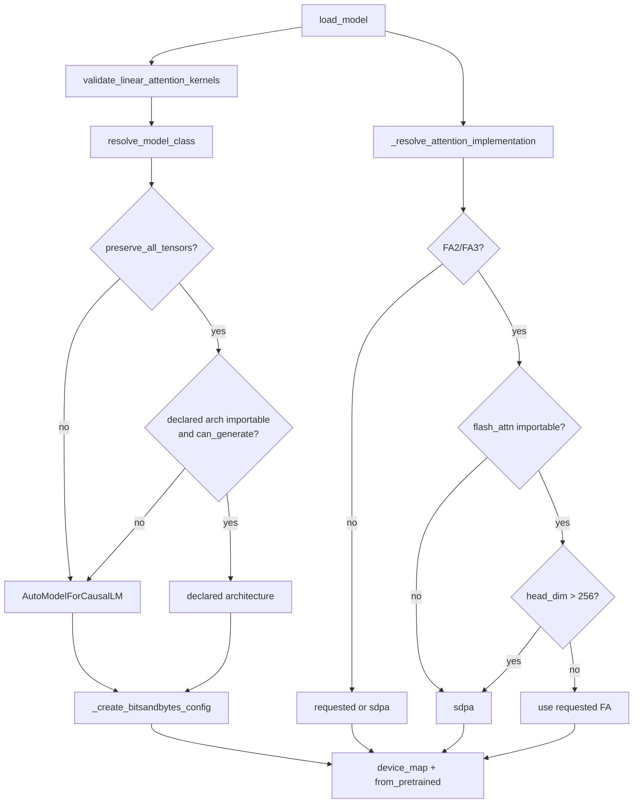

# src/model_setup.py

***

## Table of Contents

1.  [Overview](#overview)
2.  [Directory / Module Map](#directory--module-map)
3.  [Public Interfaces](#public-interfaces)
4.  [Execution and Control Flow](#execution-and-control-flow)
5.  [Data Flow](#data-flow)
6.  [Integration Points](#integration-points)
7.  [Configuration and Conventions](#configuration-and-conventions)
8.  [Extension and Testing Guidance](#extension-and-testing-guidance)
9.  [Visualizations](#visualizations)
10. [Mathematical Framing](#mathematical-framing)

***

## Overview

**Purpose:** Model and tokenizer loading with BitsAndBytes 4-bit quantization, Flash Attention 2/3 resolution (real import + head-dim guards), SDPA fallback, optional Qwen3.5 linear-attention kernel validation, and full-checkpoint loading via `resolve_model_class`.

**Connections:**

*   **[main](main__documentation.md):** Calls `load_model` / `load_tokenizer` in the SFT phase.
*   **[train](train__documentation.md):** Uses loaders in `run_pipeline` / merge; merge also calls `validate_linear_attention_kernels` and `resolve_model_class`.
*   **[dpo](dpo__documentation.md):** Does **not** use `load_model`’s attention resolver, but does load via `resolve_model_class`. Still calls `validate_linear_attention_kernels` when the flag is set.
*   **[inference_with_tools](inference_with_tools__documentation.md):** Own `load_model_pipeline`; validates linear kernels when enabled.
*   **[config](config__documentation.md):** `ModelConfig`, `QuantizationConfig`.
*   **[utils_and_hardware](utils_and_hardware__documentation.md):** `Environment` for CUDA/bnb/dtype.

***

## Directory / Module Map

```
src/
├── model_setup.py          # THIS MODULE
├── config.py               # ModelConfig, QuantizationConfig
├── utils.py                # Environment
├── train.py                # Consumer + merge validates kernels
├── main.py                 # Consumer (SFT phase)
├── dpo.py                  # validate_linear_attention_kernels + resolve_model_class
├── inference_with_tools.py # Own pipeline loader
└── data/                   # Dataset package (not used here)
```

**Grouping:** Loading (`load_*`) · Architecture resolution (`resolve_model_class`, `_declared_architectures`) · Attention/kernels (`_flash_attn_importable`, `_model_head_dim`, `_resolve_attention_implementation`, `validate_linear_attention_kernels`) · Quantization (`_create_bitsandbytes_config`)

***

## Public Interfaces

| Interface | Purpose |
| --------- | ------- |
| `load_tokenizer(config)` | Fast tokenizer with ModelWrapper → `use_fast=False` retry; pad=EOS; max_length; padding_side=right |
| `load_model(model_config, quant_config, env)` | Validate linear kernels; resolve model class; BnB; resolve attn; load |
| `resolve_model_class(model_name, trust_remote_code=False, preserve_all_tensors=True)` | Return the checkpoint's declared architecture so no tensors are dropped; falls back to `AutoModelForCausalLM` |
| `validate_linear_attention_kernels(enabled)` | Fail-fast if `causal_conv1d` or `fla` missing when enabled |
| `_declared_architectures(model_name, trust_remote_code)` | `architectures` from AutoConfig; `[]` when unreadable |
| `_create_bitsandbytes_config(...)` | NF4/FP4 BnB when enabled + CUDA + bnb |
| `_resolve_attention_implementation(requested, model_config=None)` | FA2/FA3 → import + head_dim ≤ 256 → else sdpa |
| `_flash_attn_importable()` | Real `import flash_attn` (not find_spec) |
| `_model_head_dim(model_config)` | `head_dim` or `hidden_size // num_attention_heads` from AutoConfig |

***

## Execution and Control Flow

### Tokenizer

```
AutoTokenizer.from_pretrained(..., use_fast=True)
  -> ModelWrapper / variant errors: retry use_fast=False
  -> pad_token = eos_token if missing
  -> model_max_length = config.max_length
  -> padding_side = "right"
```

### Model

```
validate_linear_attention_kernels(use_linear_attention_kernels)
resolve_model_class(name, trust_remote_code, preserve_all_tensors)
  -> preserve_all_tensors False: AutoModelForCausalLM (warns)
  -> declared architecture, if importable from transformers and can_generate()
  -> else AutoModelForCausalLM (warns)
_create_bitsandbytes_config(...)
_resolve_attention_implementation(attn_implementation, model_config)
  -> FA2/FA3: import flash_attn; else sdpa
  -> if head_dim > 256: sdpa
device_map = "cuda:0" if quantized+CUDA else "auto"
<resolved class>.from_pretrained(..., attn_implementation, dtype, ...)
```

***

## Data Flow

```
ModelConfig (+ use_linear_attention_kernels, preserve_all_tensors)
    |
    v
validate_linear_attention_kernels (optional fail-fast)
    |
    v
resolve_model_class  -- declared architecture, else AutoModelForCausalLM
    |
    v
_resolve_attention_implementation  -- real import + head_dim guard
    |
    v
_create_bitsandbytes_config + Environment
    |
    v
PreTrainedModel (device_map cuda:0 or auto)
```

***

## Integration Points

| Consumer | Usage |
| -------- | ----- |
| `main.py` | SFT: `load_tokenizer`, `load_model` |
| `train.py` | `run_pipeline` loaders; merge: `validate_linear_attention_kernels`, `resolve_model_class`, `load_tokenizer` |
| `dpo.py` | `validate_linear_attention_kernels`, `resolve_model_class` — **no** `attn_implementation` on its `from_pretrained` |
| `helper_scripts/dpo_merge_base.py` | `resolve_model_class` (exposed as `--preserve-all-tensors`) |
| `inference_with_tools.py` | `validate_linear_attention_kernels` via its own loader; text-only, so it still uses `AutoModelForCausalLM` |

**External:** `transformers` (`AutoModelForCausalLM`, `AutoTokenizer`, `AutoConfig`, `BitsAndBytesConfig`, plus concrete model classes looked up by name)

***

## Configuration and Conventions

**Attention resolution (FA2/FA3):**

1. Real `import flash_attn` must succeed (Windows ABI/DLL failures are caught).
2. `_model_head_dim` must be ≤ `FLASH_ATTN_MAX_HEAD_DIM` (256), else SDPA.
3. **Caveat:** `_model_head_dim` does **not** read `global_head_dim`. Models like `google/gemma-4-12B` (global head dim 512) should set `attn_implementation: sdpa` in YAML even if local `head_dim` is 256.

**Schema vs runtime:** Pydantic allows `eager|flash_attention_2|sdpa|None`. Loader also accepts `flash_attention_3`.

**Linear kernels:** When `use_linear_attention_kernels: true`, both `causal_conv1d` and `fla` must import. Install into conda `ai-factory` with `--no-deps` (cp310 / torch 2.5.1 / cu124). Never install `flash-linear-attention[cuda]` without `--no-deps`. Set the flag `false` for PyTorch fallback if DLLs fail.

**Device map:** Quantized + CUDA → `"cuda:0"` (avoids meta-device tensors with `auto`).

**Tensor preservation (`preserve_all_tensors`, default `true`):** `AutoModelForCausalLM` maps a multimodal checkpoint onto its text-only submodel. For Qwen3.5 it yields `Qwen3_5ForCausalLM`, whose `_keys_to_ignore_on_load_unexpected = ["^mtp.*", "^model.visual.*"]` discards the vision tower **with no warning** (0.46B params on Qwen3.5-9B). `resolve_model_class` loads the architecture named in the checkpoint's own `config.json` instead. Fallbacks to `AutoModelForCausalLM` (each logged): the flag is off, the config is unreadable, the class is absent from the installed transformers (vendor/remote code), or `can_generate()` is False. LoRA targeting is unaffected — Qwen3.5's vision blocks are named `qkv` / `proj` / `linear_fc1|2` and never match `q_proj`-style `target_modules`. The `mtp.*` head is dropped either way; no transformers class holds it.

***

## Extension and Testing Guidance

*   Extend FA list via `FLASH_ATTN_IMPLEMENTATIONS`.
*   Consider teaching `_model_head_dim` to inspect `global_head_dim` for Gemma-class models.
*   Tests: `tests/test_model_setup.py` (mock imports / head_dim / kernel validation); `tests/test_preserve_tensors.py` (class resolution rules + a miniature Qwen3.5 checkpoint with a real vision tower run through the merge path).

***

## Visualizations



***

## Mathematical Framing

NF4 QLoRA ~0.5 bytes/param vs 2 bytes FP16. LoRA overhead for rank `r` and target modules is small vs base weights. FA2 requires per-head dim ≤ 256; exceeding that must use SDPA.

***

*Last updated: 2026-08-23.*
