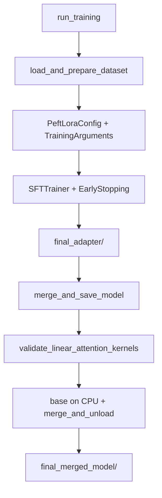

# src/train.py

## 1. Overview

The `train.py` module orchestrates QLoRA supervised fine-tuning (SFT), adapter save, and merge of LoRA weights into a standalone base model.

**Purpose:** Dataset → LoRA SFTTrainer → `final_adapter/` → CPU merge → `final_merged_model/`.

**Connections:**

*   **[main](main__documentation.md):** Calls `run_training` and `merge_and_save_model` inside the full 4-phase `main.run_pipeline`.
*   **`train.run_pipeline`:** Local helper that runs **SFT + merge only** (no DPO/inference). Prefer `main` for the full product pipeline.
*   **[data](data__documentation.md):** `load_and_prepare_dataset`, `VectorizedCompletionOnlyCollator` (ICDU → `text`).
*   **[model_setup](model_setup__documentation.md):** `load_model`, `load_tokenizer`, `validate_linear_attention_kernels` (merge).
*   **[config](config__documentation.md) / [utils](utils_and_hardware__documentation.md):** `ScriptConfig`, `Environment`.

## 2. Directory/Module Map

```
ai-factory/
├── src/
│   ├── train.py              # <-- THIS MODULE
│   ├── config.py
│   ├── data/                 # VectorizedCompletionOnlyCollator, load_and_prepare_dataset
│   ├── model_setup.py
│   ├── utils.py
│   └── main.py               # Full pipeline imports run_training / merge_and_save_model
├── tests/
│   └── test_train.py
└── docs/codebase_docs/
    └── train__documentation.md
```

## 3. Public Interfaces

| Function | Signature | Description |
| -------- | --------- | ----------- |
| `run_training` | `(config, env, tokenizer, model) -> None` | ICDU dataset, LoRA from config, SFTTrainer, save `final_adapter/` |
| `merge_and_save_model` | `(config, env) -> None` | Validate linear kernels; load base on CPU; merge PEFT; save `final_merged_model/` + tokenizer |
| `run_pipeline` | `(config) -> None` | **SFT + merge only** (not DPO/inference) |

### Internal helpers

| Function | Role |
| -------- | ---- |
| `_determine_effective_optimizer` | `paged_*` → `adamw_torch` if no CUDA/bnb |
| `_prepare_training_arguments` | Map `TrainingConfig` → TrainingArguments fields; bf16/fp16; logging_dir |
| `_configure_best_model_loading` | Sync eval/save strategies for `load_best_model_at_end` |
| `_prepare_trainer_kwargs` | Collator (`Assistant: `), EarlyStopping(patience=3), TRL signature probes |
| `_pre_tokenize_datasets` | Fallback when SFTTrainer lacks `tokenizer` kwarg |

## 4. Execution and Control Flow

### run_training

```
load_and_prepare_dataset(config.data, tokenizer)   # ICDU required
PeftLoraConfig from config.lora (full target_modules list)
_prepare_training_arguments → TrainingArguments
if gradient_checkpointing: model.config.use_cache = False
_prepare_trainer_kwargs → SFTTrainer
trainer.train() → save final_adapter/
```

### merge_and_save_model

```
require final_adapter/
validate_linear_attention_kernels(config.model.use_linear_attention_kernels)
AutoModelForCausalLM.from_pretrained(base, device_map="cpu", ...)  # no attn_implementation kwarg
PeftModel.from_pretrained → merge_and_unload → final_merged_model/
load_tokenizer → save alongside
```

### train.run_pipeline vs main.run_pipeline

| | `train.run_pipeline` | `main.run_pipeline` |
|--|----------------------|---------------------|
| SFT | yes | yes |
| Merge | yes | yes |
| DPO | no | yes |
| Inference | no | optional `--run-inference` |

## 5. Data Flow

```
ICDU JSONL → load_and_prepare_dataset → Dataset(text)
    → VectorizedCompletionOnlyCollator (mask prompt; loss on Assistant:)
    → SFTTrainer + LoRA → final_adapter/
    → merge on CPU → final_merged_model/
```

## 6. Integration Points

| Module | Usage |
| ------ | ----- |
| `trl.SFTTrainer` | Training loop |
| `peft` | LoRA + merge |
| `transformers.EarlyStoppingCallback` | patience=3 |
| `src.data` | Dataset + collator |
| `src.model_setup` | Load / kernel validation |

## 7. Configuration and Conventions

*   Training fields filtered to names present on current `TrainingArguments`.
*   Collator response template: `"Assistant: "` (must match ICDU chat formatting).
*   Sample default model in repo config: `Qwen/Qwen3.5-9B`.
*   Merge does not re-apply Flash/SDPA selection from `load_model`.

## 8. Extension and Testing Guidance

*   Tests: `tests/test_train.py` (mock trainer / merge paths).
*   New TrainingArguments fields: add to `TrainingConfig` — they pass through if HF accepts them.
*   Do not assume `train.run_pipeline` includes DPO.

## 9. Visualizations



## 10. Mathematical Framing

Effective batch = `per_device_train_batch_size × gradient_accumulation_steps × num_devices`. Early stopping monitors `metric_for_best_model` (typically `eval_loss`) with patience 3.

***

*Last updated: 2026-08-02.*
